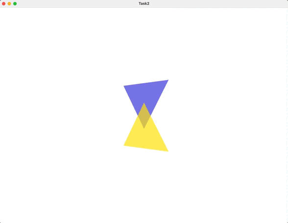

# Computer graphics

OpenGL tasks on computer graphics course.

------------------------
## Task 1
Two intersecting triangles with different fragment shaders.

--------------------------
## Task 2
Camera rotation for triangles from previous tasks.

--------------------------
## Task 3
Sims octahedron.

-------------------------

## Build

The project was build on Mac. Setup order for Mac:
1. Install `brew`.
2. Using brew install `glfw3`, `glew`, `glm`.

If you want to do another tasks you can follow instructions:
1. Make a folder called `Task_n` and copy CmakeFile from previous tasks there.
2. Name shader files with `.glsl` extension.
3. Put shader files into `shader` subfolder of your task folder (CMake will copy `.glsl` files to your `Task_n/bin/` directory).
4. Binary output folder is `Task_n/bin/`

## Links
- [OpenGL tutorials](https://www.opengl-tutorial.org/ru/)
