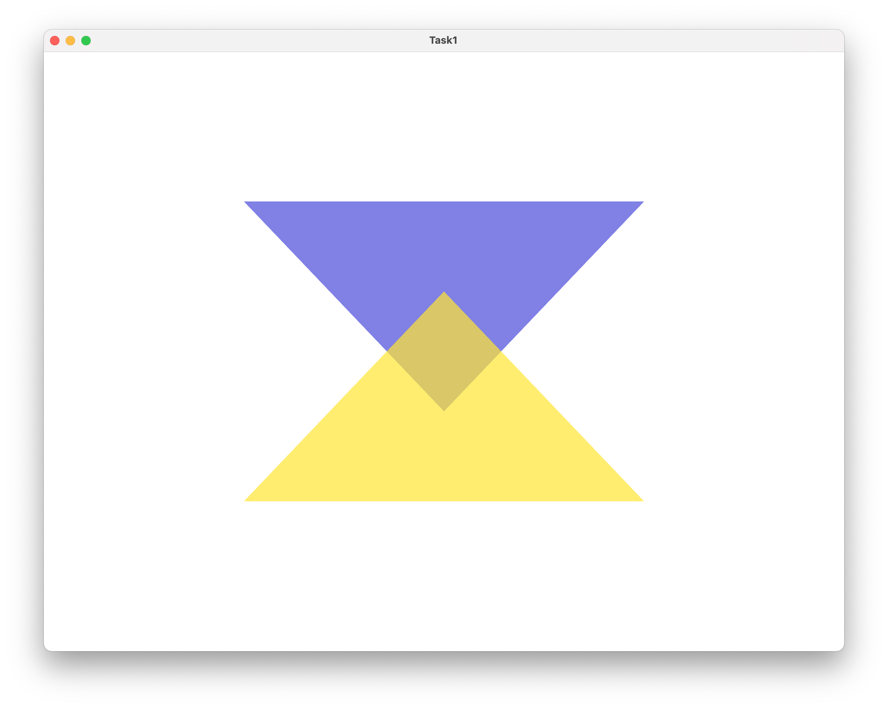

# Computer graphics

OpenGL tasks on computer graphics course.

------------------------
## Task1
Two intersecting triangles with different fragment shaders.

-------------------------

## Build

The project was build on Mac. Setup order for Mac:
1. Install `brew`.
2. Using brew install `glfw3`, `glew`, `glm`.
3. Name shader files with .glsl extension
4. Binary output folder is Task_n/bin/
5. Put your shader files in shader folder (CMake will copy `.glsl` files to your Task_n/bin/ directory)

## Links
- [OpenGL tutorials](https://www.opengl-tutorial.org/ru/)
